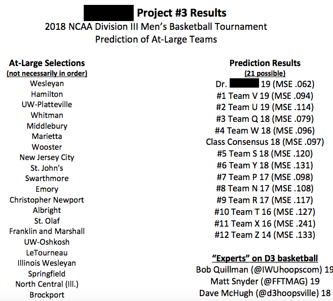

# D3 Basketball Tournament At-Large Bid Predictions

This team project attempted to predict the 'at-large' DIII basketball teams that would be invited to the 2018 division DIII March Madness tournament. There are two ways a team can be invited to the tournament. First, if the team wins its division, then it will automatically receive an invitation. Second, if the team does not win its division but still does well, then that team can still get an invitation if the DIII basketball committee votes to invite it. The teams that are contending for the committee's votes are considered 'at-large' teams. There are 21 at-large teams and 43 automatically-invited teams every year.

A random forest was tuned, trained, validated, and tested on historical data (2013 to 2017 at-large teams). My team partner and I were 'Team U,' and, as can be seen below, our random forest model correctly predict 19 of 21 the at-large bids. This number was the same as our professor's and as good or better than DIII basketball 'experts' and our classmates. We received 2nd place because our mean squared error (MSE) was slightly higher than that of the other team who also correctly predicted 19 of the 21 at-large bids.

